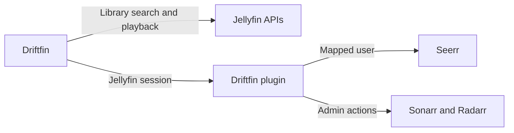

# Driftfin plugin: discovery, server-side integrations, and diagnostics

Status: implementation in progress. Updated 2026-09-19.

## Implementation evidence

- Existing Jellyfin 12, Seerr lifecycle, and download settings fixes are isolated
  in [PR #76](https://github.com/Ironside-Software/Driftfin/pull/76).
  Baseline: 1,627 Flutter tests pass; three credential-dependent tests skip.
- Plugin capabilities, admin diagnostics, bounded HTTP transport, exact Seerr
  identity/pairing checks, explicit Seerr operations, response projection, and the
  discovery endpoint are implemented. The native library matcher uses provider
  IDs and user-scoped Jellyfin queries; its populated-library smoke coverage is
  still required.
- The disposable Jellyfin 12 + real Seerr 3.4.1 smoke test proves two-user
  attribution, distinct quotas, pending requests, manager-only approval,
  missing mappings, spoofed identity rejection, discovery request state, and
  parental-policy rejection. The test caught and fixed Seerr search omitting
  request ownership; tracked catalog results now fetch detail ownership before
  projection. CI runs this fixture before packaging the plugin.
  Current backend checkpoint: 65 C# tests, seven Python checks, workflow
  actionlint, and the live Jellyfin/Seerr smoke test pass.
- The operation inventory test covers every current `SeerrChopperService` route.
  Password/cookie login and logout remain direct-mode-only; managed calls use
  Jellyfin sessions. Managed request ownership is always the caller, so the app's
  on-behalf-of user selector must be hidden in managed mode. Advanced profiles,
  tags and opaque folder IDs are validated against saved service options.
- Still required: app status UI/lifecycle, Sonarr/Radarr adapters, managed app and
  background-worker transports, active unified-search UI, migration/provenance,
  populated-library matching tests, platform gates, full regression/coverage, and
  final PR review. No feature release or merge has been performed.

## Agreed scope

Unified search launches **inside Driftfin**. Sonarr and Radarr management is
**Jellyfin-admin-only**. Regular users request media through their own Seerr
identity and permissions.

Build on the pending Jellyfin 12 plugin, Seerr lifecycle fix, and Downloads &
Offline fix. Those changes must be reviewed and delivered independently of this
larger feature set; do not hold the fixes until this plan is complete.

The first release covers movie/TV discovery, existing Seerr functionality through
the plugin, existing Sonarr/Radarr actions through admin-only plugin endpoints,
and integration capability/status reporting. Ordinary library browsing, playback,
watch history, and existing settings synchronization continue using Jellyfin's
existing APIs. Installing the plugin remains optional.

## Architecture and repository seams

Driftfin authenticates to the plugin with its existing Jellyfin session. The
plugin derives the caller from that session and calls only administrator-configured
integrations with server-held credentials.

Reuse `server_integration_config_provider.dart`, `seerr_api_provider.dart`,
`seerr_service_provider.dart`, `sonarr_provider.dart`, and `radarr_provider.dart`.
Add a managed transport to these existing paths instead of a second integration
stack. Reuse the current Seerr detail/request UI and library poster components.

The active search entry point is `LibrarySearchRoute` / `LibrarySearchScreen`
with `library_search_provider.dart`; `screens/search/search_screen.dart` is not
the main routed search screen. Extend the active global-search flow. Scoped
library/folder searches, music, photos, favorites, and saved filters retain their
current semantics.

Use a dedicated plugin discovery endpoint. Jellyfin 12's native search-provider
contract returns item IDs, and an open upstream issue reports access filtering
of virtual titles outside libraries. Do not create fake library entries or depend
on a Jellyfin fork to show catalog titles. Integration with Jellyfin's own web
search is a later, separate scope.

## 1. Capabilities and useful diagnostics (#2)

Add `GET /Driftfin/v1/capabilities`, authenticated and specific to the caller.
Return plugin version, protocol version, and supported/allowed features, including
external discovery, media requests, request management, and arr management. Also
return integration state with stable reason codes. Exclude API keys, cookies,
internal URLs, upstream user lists, and raw upstream errors.

Keep three facts distinct: the plugin supports a feature, the user may use it,
and its upstream service is currently healthy. Examples of reasons:
`not_configured`, `user_not_linked`, `permission_denied`, `unreachable`,
`invalid_credentials`, and `unsupported_version`. A failed probe must not turn a
configured integration into an apparently unconfigured one.

Add admin-only `POST /Driftfin/v1/integrations/{service}/check` for a fixed set of
services. It tests the saved configuration, never a URL supplied by the client.
Return redacted diagnostics plus a correlation ID and last-check time. Regular
users see a safe explanation and next action; administrators can inspect useful
connection details without exposing credentials.

In Driftfin, show these states in Settings → Integrations. Load capabilities on
login, refresh after setup changes or explicit retry, and clear them on logout or
server switch. Distinguish a missing plugin (404), expired login (401), denied
operation (403), incompatible protocol, and an upstream outage. Server status
must not hide device-local settings such as download storage controls.

**Acceptance:** users can tell why a feature is unavailable; admins can verify a
connection; ordinary users cannot call diagnostics reserved for admins or obtain
server credentials. An old/missing plugin leaves core library features usable.

## 2. Server-side integration requests (#1)

### Identity and authorization

Map the authenticated Jellyfin user ID to Seerr's `jellyfinUserId`, within the
configured Jellyfin/Seerr server pairing. Do not match by display name or accept
a Seerr user ID from the app. Verify this behavior against the deployed Seerr
version before enabling managed requests. Seerr 3.4.1 provides the identity field
and `X-API-User` mechanism; compatible Jellyseerr versions require the same checks.

For every user-context Seerr call, send the server-held API key and the mapped
`X-API-User`. Seerr otherwise defaults API-key calls to its owner account. Never
fall back to that account when mapping fails. An unlinked user receives an
explicit state; an admin can import/link the user and retry. No automatic user
creation or password forwarding in the first release.

Preserve Seerr quotas, request ownership, approval rules, 4K rights and management
permissions. Jellyfin admin status alone does not grant Seerr-owner permissions.
Reject or derive ownership fields such as `requestedBy` rather than forwarding
client-supplied identity. Recheck permission at action time; capability flags only
drive the UI.

Sonarr/Radarr operations additionally require Jellyfin's administrator policy on
every endpoint. Non-admin access must fail even when calling the API directly.
There is no custom role editor in this release.

### Bounded service adapters

Expose only operations used by Driftfin, through explicit routes and validated
request/response shapes. Proposed route groups are `/Driftfin/v1/seerr`,
`/Driftfin/v1/sonarr`, and `/Driftfin/v1/radarr`; this is not an arbitrary URL or
path-forwarding proxy.

- Seerr: current-user information/quotas, search/discovery/details, requests and
  the existing permission-checked management actions used by the app.
- Sonarr/Radarr: the existing lookup, calendar, request/add, monitor and search
  operations. Root folders and quality profiles remain administrator-controlled;
  reject unapproved IDs rather than accepting arbitrary filesystem paths.
- Explicitly inventory currently used endpoints before switching an integration
  to managed mode. Unknown operations fail rather than silently switching to
  privileged direct access.

Use .NET's existing HTTP client facilities with cancellation, bounded responses,
input/page-size limits and timeouts. Only admin-configured destinations are
allowed; disable credential-bearing cross-origin redirects. Do not forward the
Jellyfin Authorization header, arbitrary client headers, or upstream cookies.
Project upstream responses to approved DTOs so nested service credentials and
raw error bodies cannot leak. Log correlation IDs and outcomes without tokens or
secret-bearing bodies. Do not retry mutations automatically when their outcome
is uncertain; refresh request status before offering a retry.

Keep public metadata caching separate from user-specific availability, quotas,
and actions. Any permission-sensitive cache is scoped to the server and user,
and invalidated appropriately. Avoid adding a database, job queue, or generic
plugin adapter framework for this work.

**Acceptance:** a client that can reach only Jellyfin can use configured
integrations; credentials never appear in managed-mode responses or client
storage; a normal user cannot impersonate another user, exceed Seerr permissions,
or invoke arr management. Existing supported integration UI continues to work.

## 3. Unified discovery in Driftfin (#5)

Add an explicit search scope to the existing global search: **All**, **Library**,
and **Discover**. When supported, All combines accessible library results with
external movie/TV results; Library keeps the existing behavior. Advanced
library-only filters stay in Library mode. Global empty search keeps the current
landing behavior; do not add a recommendation engine to this release.

Run existing Jellyfin library search and plugin catalog search independently so
library results appear without waiting for Seerr. Add
`GET /Driftfin/v1/discovery/search?query=...&page=...&language=...`, using Seerr's
catalog rather than introducing a second TMDB credential/setup flow.

The plugin enriches external results with matches from libraries accessible to
the current Jellyfin user. Match by media type and stable provider IDs (TMDB,
TVDB, IMDb), never title alone. Return catalog IDs, minimal display metadata,
allowed actions, and accessible Jellyfin item IDs. An external result remains a
catalog result until a real library match exists.

Use clear states: **Available**, **Partially available** (TV seasons),
**Requested**, **Requestable**, and **Unavailable**. Play only when the current
user has access and playback permission. Show request state only as permitted by
Seerr. Hidden-library presence, other users' requests, server paths and filenames
must not leak through labels or matching.

Apply parental/content restrictions to external discovery as well. For the first
release, fail closed for restricted accounts whose policies cannot be represented
reliably by the catalog; expose the restriction through capabilities while keeping
library search available. Do not silently equate a Seerr adult-content toggle
with Jellyfin's complete parental/tag policy.

Merge duplicate movie/series cards by provider ID and media type, with an
accessible library result taking precedence and existing detail/playback routes
reused. Preserve each source's independent pagination and ordering; do not invent
a combined total count or skip later external results after deduplication.

Typing a new query cancels/invalidates the previous request. Late results after
account/server changes or screen disposal are ignored. Clearing search clears
both sources. A Seerr timeout shows a retryable discovery message beside working
library results. Missing plugins/configuration provide a useful explanation.
Managed integration failures never trigger a fallback using old privileged keys.

**Acceptance:** one search finds an owned title and a requestable title; overlap
produces one card; TV partial availability is accurate; requests use the correct
Seerr account; unavailable Seerr does not break library search; results never
cross users or resurrect after navigation.

## Implementation sequence and delivery gates

| Stage | Deliverable | Required proof |
| --- | --- | --- |
| 1 | Versioned capabilities, connection checks and status UI | Auth/status contract tests and missing/old-plugin widget tests |
| 2 | Seerr identity mapping and managed transport | Two-user Seerr tests for quotas, attribution, approvals, missing mapping and identity spoofing; existing feature coverage |
| 3 | Admin-only Sonarr/Radarr transport | Admin success, non-admin 403, input validation, upstream failures and no secret leakage |
| 4 | Unified search and existing detail/request integration | Duplicate IDs, pagination, scoped filters, partial results, restricted accounts, cancellation and cross-account isolation |
| 5 | Coordinated migration and release | Old/new app-plugin combinations, Jellyfin 12 smoke tests, Windows UI verification and signed iOS build checks |

Use unit tests for mapping/authorization/normalization, C# endpoint tests with
controlled upstreams, Flutter provider/widget tests, and a disposable Jellyfin 12
server with admin and non-admin users. Extend the existing smoke-test harness.
For Seerr attribution, include a real supported Seerr instance with fixture users;
mocks alone cannot prove that upstream quotas and approval behavior are preserved.
Run required formatting/static analysis and relevant regression suites.

## Migration and compatibility

The new protocol is independent of plugin assembly version. Feature discovery
selects supported behavior rather than hardcoded version comparisons. New app +
old plugin remains usable, but labels the legacy integration behavior clearly.
New app + new plugin uses the managed paths. Plugin absence keeps explicit,
manually configured direct integrations available.

Release the compatible app before enabling the new plugin protocol for users.
The new plugin stops returning integration secrets from the legacy
`GET /Driftfin/Config`; an old app receives an explicit upgrade-required response
for that contract. Document this as a breaking managed-integration change. Core
Jellyfin browsing/playback continues to work. No default-on legacy key-sharing
compatibility switch.

Record credential provenance in the compatible app. On migration, remove known
plugin-injected credentials from local accounts, preferences and exports while
preserving manually configured integrations. Legacy values with unknown origin
must not be blindly deleted or used as automatic fallback. Retiring this endpoint
cannot revoke keys already copied to old clients; provide an administrator-led
key-rotation step after migration, without automatic rotation.

Personal Trakt OAuth flows and a wider Trakt server proxy are outside this scope.
The new non-secret bootstrap must not redistribute Trakt client secrets either;
legacy server-provided Trakt app configuration requires an explicit migration
notice rather than being silently lost.

Keep the plugin GUID and saved server configuration. Retain older-server artifacts
in the catalog and publish only tested artifacts. Gate managed features behind
capabilities so an integration can be disabled while core app features remain
usable. Before rollout, verify the deployed Seerr/Jellyseerr and arr versions;
unsupported identity semantics block managed mode rather than relaxing permissions.

## Sources checked

- [Jellyfin 12 external search contract](https://github.com/jellyfin/jellyfin/blob/v12.0/MediaBrowser.Controller/Library/IExternalSearchProvider.cs).
- [Reported filtering limitation for virtual search results](https://github.com/jellyfin/jellyfin/issues/17972).
- [Seerr 3.4.1 API-key user attribution](https://github.com/seerr-team/seerr/blob/v3.4.1/server/middleware/auth.ts).
- [Seerr 3.4.1 Jellyfin user identity](https://github.com/seerr-team/seerr/blob/v3.4.1/server/entity/User.ts).
- [Seerr permission and request-limit behavior](https://docs.seerr.dev/using-seerr/settings/users/).
